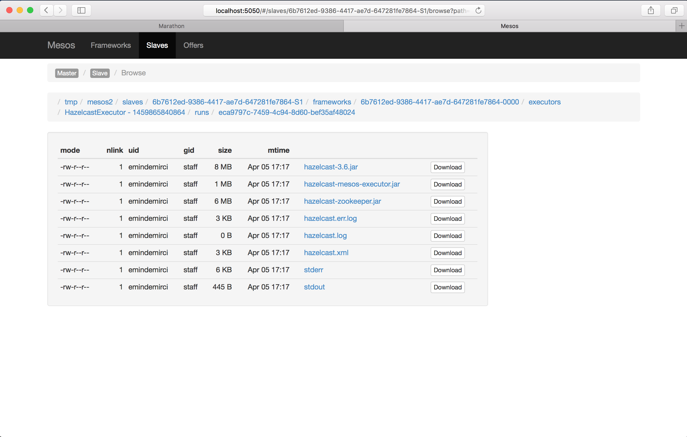

## Warning
This is an early version of Hazelcast Mesos integration. Anything in this project may change without notice and/or break older installations.

# Hazelcast Mesos

This module gives you the ability to deploy Hazelcast on the Mesos cluster.

## Prerequisites

- A running Mesos cluster to deploy Hazelcast on it. For information on installing and running Apache Mesos, please refer to http://mesos.apache.org/gettingstarted/.
- Java needs to be installed and configured on the Mesos slaves.

## Running Hazelcast Mesos via Command Line

You can deploy Hazelcast on Mesos via command line by running the Hazelcast Scheduler. Please perform the following steps:

- Download the Hazelcast Mesos package from `http://link`.
- Extract the archive:

```bash
tar -zxvf hazelcast-mesos-0.1.tar.gz
```
- Navigate to `hazelcast-mesos-0.1`:

```bash
cd hazelcast-mesos-0.1
```
- Open the `start.sh` in the text editor and edit the configuration parameters according to your needs:

```bash
#!/usr/bin/env bash

export HAZELCAST_VERSION=3.6
export HOST="localhost"
export PORT="8090"
export MESOS_ZK="zk://localhost:2181/mesos"
export MIN_HEAP="1g"
export MAX_HEAP="1g"
export CPU_PER_NODE=1.0
export MEMORY_PER_NODE=1024.0
export NUMBER_OF_NODES=1

java -cp hazelcast-mesos-scheduler.jar HazelcastMain
```
- Run the scheduler:

```bash
sh start.sh
```
- Open the Mesos UI at `http://localhost:5050`. You should see the Hazelcast tasks with state `RUNNING` .


The scheduler will pull the Hazelcast binaries from web and distribute it to Mesos slaves and start the Hazelcast nodes. **Hazelcast Scheduler will place only one Hazelcast member per Mesos slave.**

You can control the cluster size of Hazelcast via the REST API it provides.
For example, to scale Hazelcast cluster to 5 nodes, run the following command:

```bash
curl -X POST http://localhost:8090/nodes?nodeCount=5
```

## Running Hazelcast Mesos via Marathon

You can deploy Hazelcast on Mesos via Marathon.

For information on installing Marathon, please refer to https://docs.mesosphere.com/getting-started/datacenter/install/.

After you install Marathon, please perform the following steps:

- Save the following JSON as `hazelcast.json`:

```json
{
  "id": "/hazelcast",
  "instances": 1,
  "cpus": 1,
  "mem": 1024,
  "ports": [
    0
  ],
  "env": {
    "HAZELCAST_VERSION": "3.6",
    "HOST": "localhost",
    "PORT": "8090",
    "MESOS_ZK": "zk://localhost:2181/mesos",
    "MIN_HEAP": "1g",
    "MAX_HEAP": "1g",
    "CPU_PER_NODE": "1.0",
    "MEMORY_PER_NODE": "1024.0",
    "NUMBER_OF_NODES": "3"
  },
  "cmd": "cd hazelcast-mesos-0.1 && java -cp hazelcast-mesos-scheduler.jar HazelcastMain",
  "uris": [
    "https://s3.amazonaws.com/hazelcast/mesos/hazelcast-mesos-1.0-SNAPSHOT.tar.gz"
  ]
}
```
- Initiate a POST request to Marathon REST API:

```bash
curl -X POST http://localhost:8080/v2/apps -d @hazelcast.json -H "Content-type: application/json"
```
- Open the Marathon UI at `http://localhost:8080`. You should see the `hazelcast` application with state `Running`:


- Open the Mesos UI at `http://localhost:5050`. You should see the Hazelcast tasks with state `RUNNING`:


- Click the `Sandbox` link to see the working directory of task:



- You can have a look at the logs of Hazelcast by clicking on the `hazelcast.log` or `hazelcast.err.log` links.


## Configuration

You can pass environment variables to configure Hazelcast Mesos integration. You can pass those environment variables either in the Marathon recipe or in the `start.sh`.

| Variable Name  | Default Value   | Description   |
|---|---|---|
| HAZELCAST_VERSION  |  3.6  |  To be deployed distribution version of hazelcast.  |
| HOST  | localhost   | Internal web server host which Hazelcast Scheduler uses for file distribution to Mesos Slaves.  |   
| PORT  | 8090 | Internal web server port which Hazelcast Scheduler uses for file distribution to Mesos Slaves.  |
| MESOS_ZK | zk://localhost:2181/mesos | ZooKeeper address which Mesos Master uses for coordination |
| MIN_HEAP | 1g | Java minimum heap size for the JVM which Hazelcast instance lives on the Mesos Slave.|  
| MAX_HEAP | 1g | Java maximum heap size for the JVM which Hazelcast instance lives on the Mesos Slave. |
| CPU_PER_NODE | 1.0 | Number of CPU units to be used for each Hazelcast instance deployment on the Mesos Slaves. |
| MEMORY_PER_NODE | 1024.0 | Amount of Memory units to be used for each Hazelcast instance deployment on the Mesos Slaves. |   
| NUMBER_OF_NODES | 1 | Size of the Hazelcast cluster.|    
