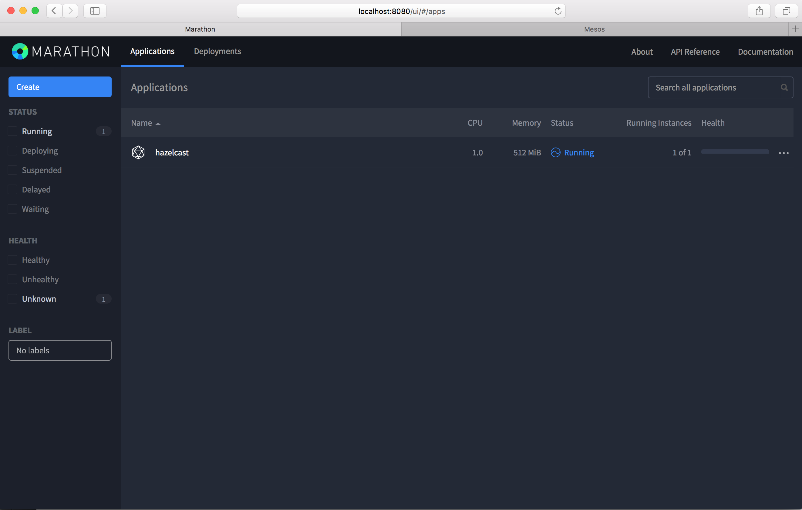
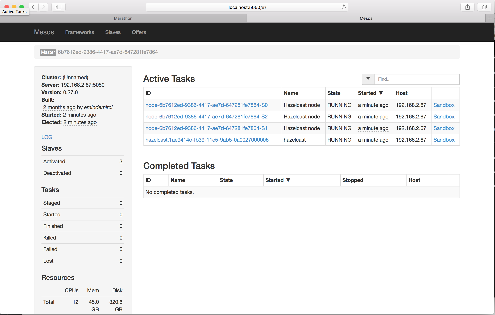
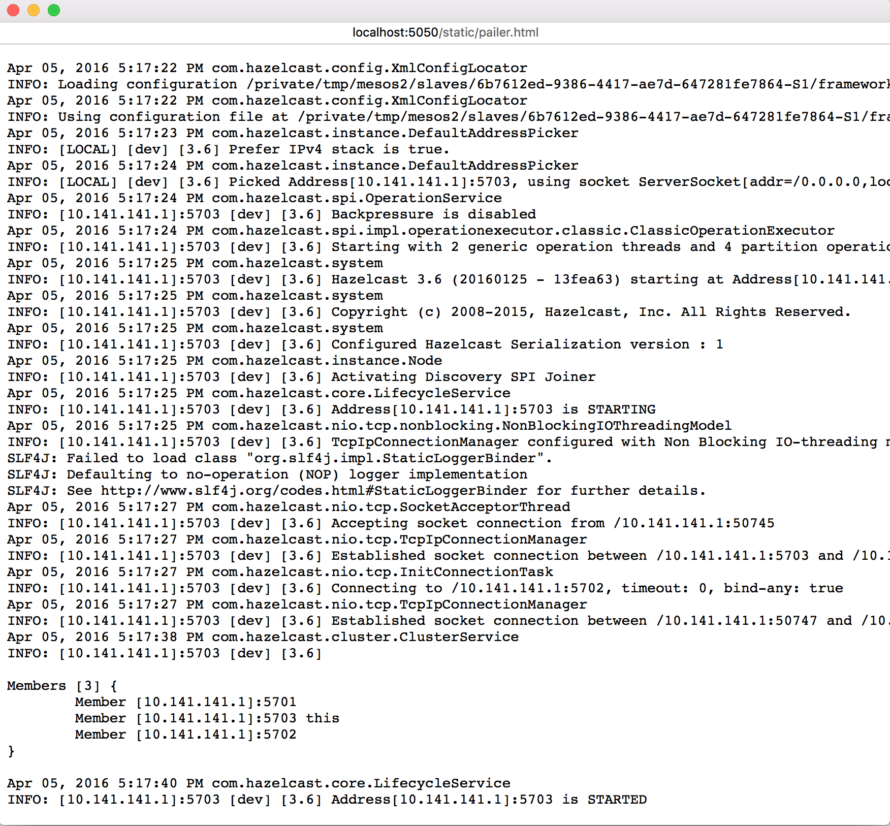

# Hazelcast Mesos

This module gives you an ability to deploy Hazelcast in the Mesos cluster.

## Running Hazelcast-Mesos via command line
You can deploy Hazelcast on Mesos via command line by running the Hazelcast Scheduler.

You need to have a running Mesos cluster to deploy Hazelcast to it. To install and run the Apache Mesos please refer to http://mesos.apache.org/gettingstarted/

- Download the Hazelcast-Mesos package from `http://link`
- Extract the archive
```bash
tar -zxvf hazelcast-mesos.tar.gz
```
- Navigate to `hazelcast-mesos`
```bash
cd hazelcast-mesos
```
- Open the `start.sh` in the text editor and edit the configuration parameters as your needs

```bash
#!/usr/bin/env bash

export HAZELCAST_VERSION=3.6
export HOST="localhost"
export PORT="8090"
export MESOS_ZK="zk://localhost:2181/mesos"
export MIN_HEAP="1g"
export MAX_HEAP="1g"
export CPU_PER_NODE=1.0
export MEMORY_PER_NODE=512.0
export NUMBER_OF_NODES=1

java -cp hazelcast-mesos-scheduler.jar HazelcastMain
```
- Run the scheduler by issuing the command below
```bash
sh start.sh
```

The scheduler will pull the Hazelcast binaries from web and distribute it to Mesos slaves and starts the Hazelcast nodes. Hazelcast Scheduler will place one Hazelcast member per Mesos slave.

You can control cluster size of the Hazelcast via the REST API it provides.
For example, to scale Hazelcast cluster to 5 nodes issue the following command.
```bash
curl -X POST http://localhost:8090/nodes?nodeCount=5
```

## Running Hazelcast-Mesos via Marathon
You can deploy Hazelcast on Mesos via Marahton.

To install Marathon, you can refer to https://docs.mesosphere.com/getting-started/datacenter/install/.

After that,
- Save the following JSON as `hazelcast.json`
```json
{
  "id": "/hazelcast",
  "instances": 1,
  "cpus": 1,
  "mem": 1024,
  "ports": [
    0
  ],
  "env": {
    "HAZELCAST_VERSION": "3.6",
    "HOST": "localhost",
    "PORT": "8090",
    "MESOS_ZK": "zk://localhost:2181/mesos",
    "MIN_HEAP": "1g",
    "MAX_HEAP": "1g",
    "CPU_PER_NODE": "1.0",
    "MEMORY_PER_NODE": "512.0",
    "NUMBER_OF_NODES": "3"
  },
  "cmd": "cd hazelcast-mesos && java -cp hazelcast-mesos-scheduler.jar HazelcastMain",
  "uris": [
    "https://s3.amazonaws.com/hazelcast/mesos/hazelcast-mesos-1.0-SNAPSHOT.tar.gz"
  ]
}
```
- Initiate POST request to Marathon REST API via issuing the command below
```bash
curl -X POST http://localhost:8080/v2/apps -d @hazelcast.json -H "Content-type: application/json"
```
- Open Marathon UI at `http://localhost:8080`. You should see the `hazelcast` application with status `Running` .



- Open Mesos UI at `http://localhost:5050`. You should see the hazelcast tasks with state `RUNNING` .



- Click the `Sandbox` link to see working directory of the task.


- You can have a look at the logs of the Hazelcast by clicking `hazelcast.log` or `hazelcast.err.log` links.



##Configuration
